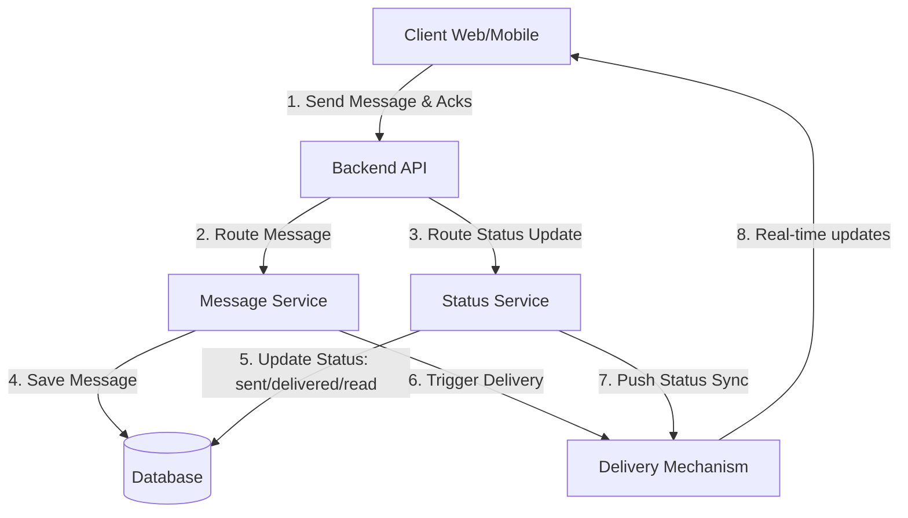

```mermaid
graph TD
    Client[Client Web/Mobile] -->|1. Send Message & Acks| API[Backend API]
    API -->|2. Route Message| MsgService[Message Service]
    API -->|3. Route Status Update| StatusService[Status Service]
    MsgService -->|4. Save Message| DB[(Database)]
    StatusService -->|5. Update Status: sent/delivered/read| DB
    MsgService -->|6. Trigger Delivery| Delivery[Delivery Mechanism]
    StatusService -->|7. Push Status Sync| Delivery
    Delivery -->|8. Real-time updates| Client
```
