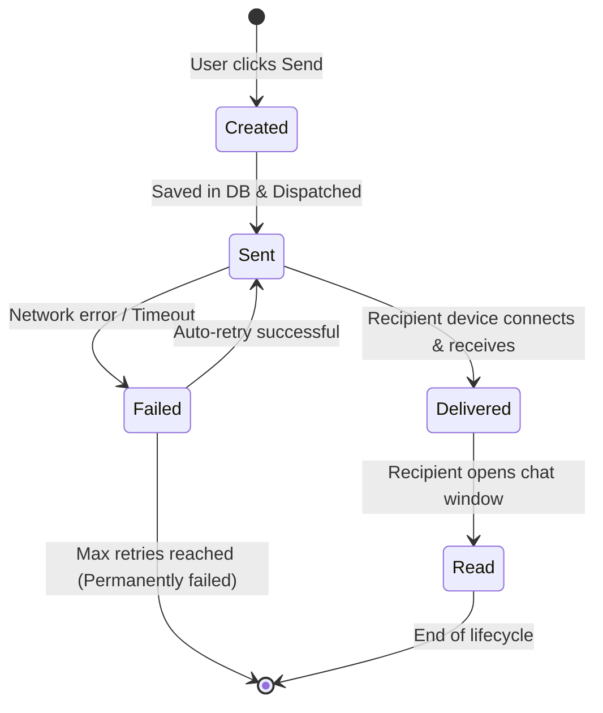

```mermaid
stateDiagram-v2
    [*] --> Created: User clicks Send
    Created --> Sent: Saved in DB & Dispatched
    
    Sent --> Delivered: Recipient device connects & receives
    Sent --> Failed: Network error / Timeout
    
    Failed --> Sent: Auto-retry successful
    Failed --> [*]: Max retries reached (Permanently failed)
    
    Delivered --> Read: Recipient opens chat window
    
    Read --> [*]: End of lifecycle
```
